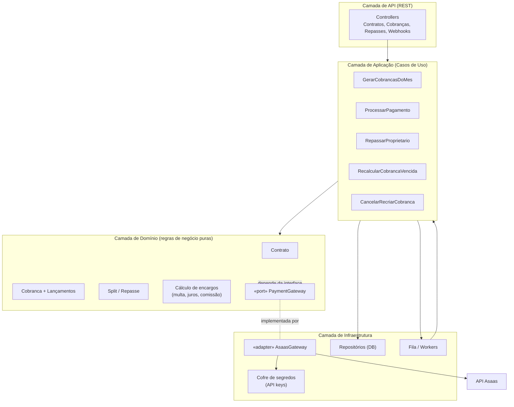
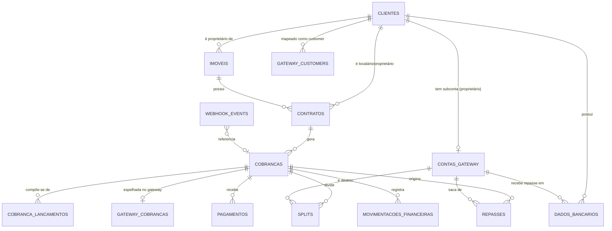
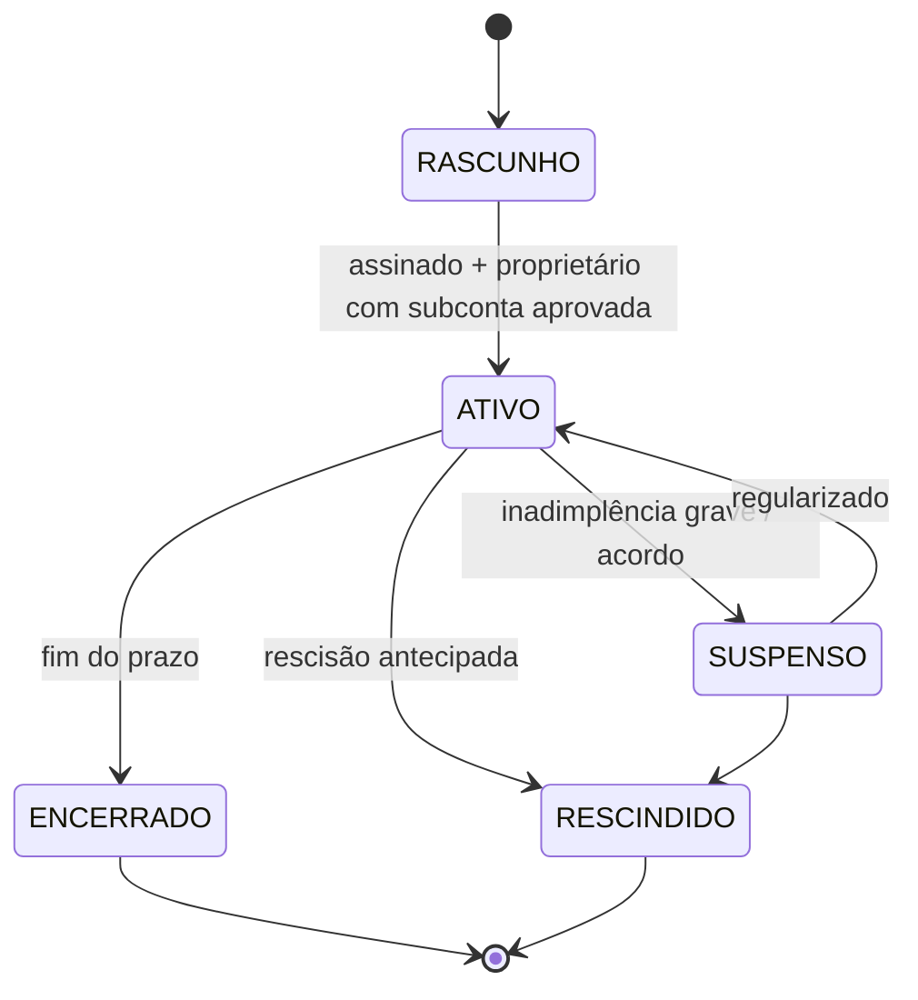
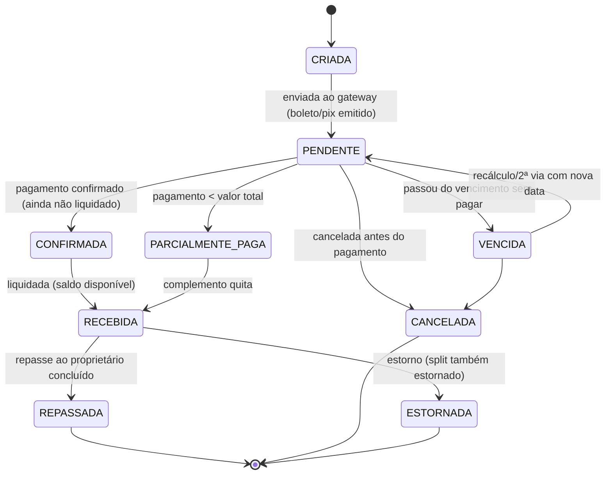
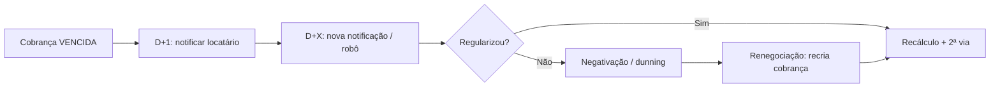
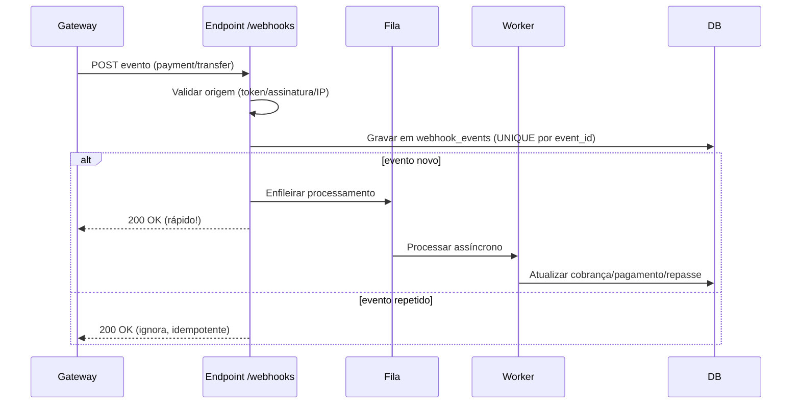
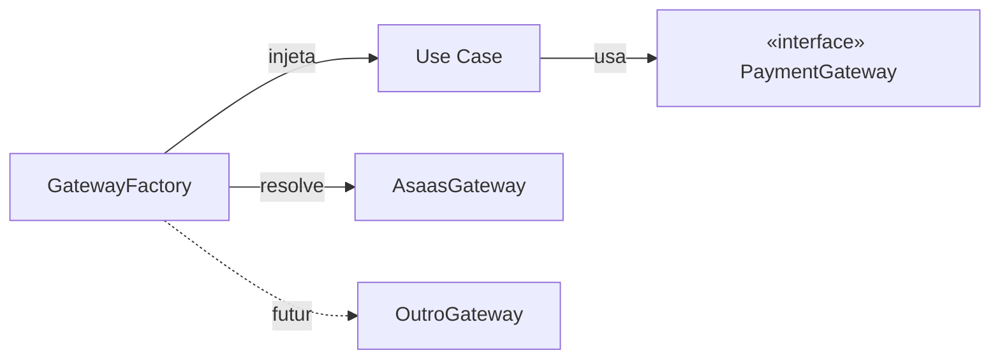

# Arquitetura do Módulo Financeiro — Plataforma de Gestão de Aluguéis

> Documento técnico de referência para implementação do módulo financeiro **antes** da integração oficial com a Asaas. A arquitetura é desenhada para ser **gateway-agnostic**: a Asaas é tratada como um *adapter* plugável, de modo que trocar ou adicionar gateways no futuro exija o mínimo de esforço.

---

## Sumário

1. [Princípios de arquitetura](#1-princípios-de-arquitetura)
2. [Visão geral em camadas](#2-visão-geral-em-camadas)
3. [Modelo de domínio e mudanças nas entidades existentes](#3-modelo-de-domínio-e-mudanças-nas-entidades-existentes)
4. [Novas tabelas e diagrama ER](#4-novas-tabelas-e-diagrama-er)
5. [Máquinas de estado (contrato e cobrança)](#5-máquinas-de-estado)
6. [Fluxo operacional ponta a ponta](#6-fluxo-operacional-ponta-a-ponta)
7. [Geração automática de cobranças](#7-geração-automática-de-cobranças)
8. [Split, subcontas e repasse](#8-split-subcontas-e-repasse)
9. [Comissão, taxas, descontos, multas e encargos](#9-comissão-taxas-descontos-multas-e-encargos)
10. [Juros/multa por atraso e recálculo de cobrança vencida](#10-jurosmulta-por-atraso-e-recálculo)
11. [Pagamentos parciais, duplicidade e inadimplência](#11-pagamentos-parciais-duplicidade-e-inadimplência)
12. [Cancelar, atualizar, recriar e segunda via](#12-cancelar-atualizar-recriar-e-segunda-via)
13. [Webhooks e controle de status](#13-webhooks-e-controle-de-status)
14. [Camada de abstração de gateway (a peça-chave da portabilidade)](#14-camada-de-abstração-de-gateway)
15. [Mapeamento das operações internas → Asaas](#15-mapeamento-das-operações-internas--asaas)
16. [Endpoints do backend](#16-endpoints-do-backend)
17. [Boas práticas: segurança, arquitetura e escalabilidade](#17-boas-práticas)
18. [Roteiro de implementação sugerido](#18-roteiro-de-implementação-sugerido)

---

## 1. Princípios de arquitetura

O erro mais comum ao integrar um gateway é **acoplar o domínio ao gateway** — espalhar chamadas HTTP da Asaas e nomes de campos da Asaas (`billingType`, `walletId`, `bankSlipUrl`) por todo o código. Quando isso acontece, trocar de gateway vira uma reescrita.

A defesa contra isso são quatro princípios:

- **Ports & Adapters (Arquitetura Hexagonal).** O domínio define *o que* precisa (uma interface `PaymentGateway`), e cada gateway implementa *como* (um adapter). O domínio nunca importa a SDK da Asaas.
- **Anti-Corruption Layer (ACL).** Toda tradução entre o vocabulário interno (`Cobranca`, `Repasse`, `FormaPagamento.BOLETO`) e o vocabulário da Asaas acontece **exclusivamente** dentro do adapter. Se a Asaas mudar um campo, só o adapter muda.
- **Fonte de verdade interna.** Seu banco é a fonte de verdade do estado financeiro. O gateway é apenas o executor. Você nunca depende de "ir perguntar pro gateway" para saber o estado de um contrato — o webhook atualiza seu banco, e seu banco responde.
- **Idempotência em tudo.** Geração de cobrança, processamento de webhook e disparo de repasse precisam ser idempotentes, porque redes falham, jobs re-executam e webhooks são reenviados.

---

## 2. Visão geral em camadas



**Responsabilidade de cada camada:**

- **API/Controllers:** validação de entrada, autenticação, tradução HTTP ↔ caso de uso. Não contém regra de negócio.
- **Aplicação (Use Cases):** orquestra o fluxo (buscar contrato → calcular valores → pedir ao gateway → persistir). É onde vive a transação de banco.
- **Domínio:** regras puras e testáveis sem banco nem HTTP (cálculo de multa, montagem do split, transições de estado). Depende apenas da **interface** `PaymentGateway`.
- **Infraestrutura:** implementações concretas — o adapter da Asaas, repositórios, fila, cofre de segredos.

---

## 3. Modelo de domínio e mudanças nas entidades existentes

Você já tem `Cliente`, `Imovel` e `Contrato`. Abaixo, as alterações recomendadas para suportar o financeiro. A regra geral: **não coloque campos de gateway diretamente nas entidades de negócio** — isole-os em tabelas de mapeamento.

### 3.1 `clientes` (locatários e proprietários)

| Campo | Tipo | Observação |
|---|---|---|
| id | uuid/bigint | PK |
| tipo_pessoa | enum(`PF`,`PJ`) | **Adicionar.** Define documento e regras. |
| cpf_cnpj | varchar | **Adicionar/normalizar.** Só dígitos. Obrigatório para o gateway. |
| nome_razao_social | varchar | |
| email | varchar | Obrigatório para o gateway. |
| telefone | varchar | |
| papel | set(`LOCATARIO`,`PROPRIETARIO`) | **Recomendado.** Um mesmo cliente pode ser os dois. Alternativamente, tabela `cliente_papeis`. |
| cep, logradouro, numero, bairro, cidade, uf | varchar | **Adicionar.** O gateway exige endereço para criar contas/cobranças. |

> **Importante:** o `gateway_customer_id` (id do locatário como *customer* no gateway) **não** fica aqui — vai na tabela de mapeamento `gateway_customers` (seção 4), porque é específico do gateway e pode haver mais de um.

### 3.2 `imoveis`

| Campo | Tipo | Observação |
|---|---|---|
| id | uuid/bigint | PK |
| proprietario_id | FK → clientes | **Garantir.** Dono que receberá o repasse. |
| endereco... | | |
| valor_condominio, valor_iptu | decimal(12,2) | **Recomendado** se você repassa/cobra esses encargos. |

> Extensão futura: coproprietários (imóvel com vários donos → split para vários `wallet_id`). Modele como tabela `imovel_proprietarios (imovel_id, cliente_id, percentual)` se precisar. Por ora, 1 proprietário por imóvel simplifica.

### 3.3 `contratos`

Esta é a entidade que mais muda, pois carrega os **parâmetros financeiros** que alimentam cada cobrança.

| Campo | Tipo | Observação |
|---|---|---|
| id | uuid/bigint | PK |
| imovel_id | FK | |
| locatario_id | FK → clientes | |
| proprietario_id | FK → clientes | Redundante com imóvel, mas evita join e permite exceção. |
| valor_aluguel | decimal(12,2) | **Adicionar.** |
| dia_vencimento | int (1–28) | **Adicionar.** Dia do mês do vencimento. Use ≤28 para evitar meses curtos. |
| forma_pagamento_padrao | enum(`BOLETO`,`PIX`,`CARTAO`,`INDEFINIDO`) | **Adicionar.** |
| comissao_tipo | enum(`PERCENTUAL`,`FIXO`) | **Adicionar.** Comissão da imobiliária. |
| comissao_valor | decimal | **Adicionar.** % (ex: 10.0000) ou valor fixo. |
| multa_percentual | decimal(5,2) | **Adicionar.** Multa por atraso (ex: 2.00). |
| juros_mensal_percentual | decimal(5,4) | **Adicionar.** Juros ao mês (ex: 1.0000 = 1%/mês, ~0,033%/dia). |
| dia_geracao_antecipada | int | **Recomendado.** Quantos dias antes do vencimento gerar a cobrança (ex: 5). |
| indice_reajuste | enum(`IGPM`,`IPCA`,...) | Opcional (reajuste anual). |
| data_inicio, data_fim | date | |
| status | enum (ver §5) | **Adicionar.** |

---

## 4. Novas tabelas e diagrama ER

Além das três que você já tem, recomendo estas tabelas novas. Elas separam **negócio** (cobrança, lançamento, repasse) de **integração** (mapeamentos de gateway) e **auditoria** (eventos, movimentações).

### 4.1 Tabelas de integração (mapeamento com o gateway)

- **`gateway_customers`** — mapeia um `cliente` (locatário) ao seu id de *customer* em cada gateway.
  `id, cliente_id, gateway, external_customer_id, created_at` — único por (`cliente_id`, `gateway`).

- **`contas_gateway`** — a **subconta** do proprietário (BaaS). O `wallet_id` daqui é o destino do split.
  `id, cliente_id (proprietário), gateway, external_account_id, wallet_id, api_key_encrypted, status (§5), onboarding_status, created_at`.

- **`dados_bancarios`** — conta/chave Pix para o repasse ao proprietário.
  `id, cliente_id, banco, agencia, conta, digito, tipo_conta, cpf_cnpj_titular, pix_key, pix_key_type, principal (bool)`.
  > Regra de negócio: `cpf_cnpj_titular` deve ser igual ao do titular da subconta, senão o saque é recusado.

### 4.2 Tabelas de negócio (financeiro)

- **`cobrancas`** — a cobrança (fatura) interna, **agnóstica de gateway**.
  `id, contrato_id, competencia (YYYY-MM), valor_total, vencimento, forma_pagamento, status (§5), tentativa, external_reference, created_at`.

- **`cobranca_lancamentos`** — os itens que compõem o `valor_total`. É aqui que taxa, multa, juros, desconto e IPTU ficam **discriminados**.
  `id, cobranca_id, tipo (ALUGUEL, TAXA_ADMIN, IPTU, CONDOMINIO, MULTA, JUROS, DESCONTO, OUTRO), descricao, valor (negativo p/ desconto), beneficiario (PROPRIETARIO|IMOBILIARIA)`.

- **`gateway_cobrancas`** — mapeia a `cobranca` interna à cobrança no gateway.
  `id, cobranca_id, gateway, external_payment_id, linha_digitavel, url_boleto, url_fatura, qr_code_pix, copia_cola_pix, status_gateway, raw_json`.

- **`splits`** — as regras de divisão de cada cobrança.
  `id, cobranca_id, conta_gateway_id (destino), tipo (FIXO|PERCENTUAL), valor, external_split_id, status`.

- **`pagamentos`** — cada recebimento efetivo. **Um-para-muitos** com `cobrancas` (suporta parcial/duplicado).
  `id, cobranca_id, valor_pago, data_pagamento, forma, external_payment_id, gateway_event_id, status`.

- **`repasses`** — a transferência da subconta do proprietário para o banco dele.
  `id, cobranca_id, conta_gateway_id, valor, metodo (PIX|TED), status (§5), external_transfer_id, solicitado_em, efetivado_em, tentativa`.

### 4.3 Tabelas de auditoria/controle

- **`webhook_events`** — idempotência e trilha de auditoria dos eventos recebidos.
  `id, gateway, external_event_id (UNIQUE), event_type, payload_json, status (RECEBIDO|PROCESSADO|ERRO|IGNORADO), recebido_em, processado_em`.

- **`movimentacoes_financeiras`** (ledger, opcional mas recomendado) — livro-razão imutável de toda entrada/saída, para conciliação.
  `id, cobranca_id, tipo, valor, origem, destino, referencia_externa, created_at`.

### 4.4 Diagrama ER



### 4.5 Exemplos de registros

**`cobrancas`**
```json
{
  "id": "cob_9f2a...",
  "contrato_id": "ctr_1234",
  "competencia": "2026-08",
  "valor_total": 1650.00,
  "vencimento": "2026-08-10",
  "forma_pagamento": "BOLETO",
  "status": "PENDENTE",
  "tentativa": 1,
  "external_reference": "ctr_1234|2026-08"
}
```

**`cobranca_lancamentos`** (compondo os R$ 1.650,00)
```json
[
  { "tipo": "ALUGUEL",     "descricao": "Aluguel Ago/2026", "valor":  1500.00, "beneficiario": "PROPRIETARIO" },
  { "tipo": "IPTU",        "descricao": "IPTU parcela 8",   "valor":   150.00, "beneficiario": "PROPRIETARIO" },
  { "tipo": "TAXA_ADMIN",  "descricao": "Comissão 10%",     "valor":  -150.00, "beneficiario": "IMOBILIARIA"  }
]
```
> Note o padrão: os lançamentos definem **quem recebe o quê**. O split é derivado deles (proprietário recebe aluguel + IPTU; imobiliária retém a comissão). Isso desacopla o cálculo do gateway.

---

## 5. Máquinas de estado

### 5.1 Contrato



### 5.2 Cobrança



> **Regra crítica:** o repasse (`REPASSADA`) só pode ocorrer a partir de `RECEBIDA` (saldo disponível). Nunca dispare repasse em `CONFIRMADA`.

---

## 6. Fluxo operacional ponta a ponta

Do contrato até o dinheiro na conta do proprietário:

```mermaid
sequenceDiagram
    participant Sched as Scheduler (Job diário)
    participant App as Backend (Use Cases)
    participant DB as Banco de Dados
    participant GW as Gateway (Asaas via Adapter)
    participant Locatario as Locatário
    participant Prop as Proprietário (só vê no seu sistema)

    Sched->>App: Rodar geração de cobranças do dia
    App->>DB: Buscar contratos ATIVOS com vencimento próximo
    App->>App: Montar lançamentos (aluguel + encargos - comissão)
    App->>App: Derivar split (aluguel → subconta do proprietário)
    App->>GW: criarCobranca(valor, vencimento, split, juros, multa)
    GW-->>App: {external_payment_id, linha_digitável, pix, url}
    App->>DB: Persistir cobranca + gateway_cobranca + splits (status PENDENTE)
    GW-->>Locatario: Boleto/Pix disponível

    Locatario->>GW: Paga o boleto/Pix
    GW-->>App: Webhook PAYMENT_CONFIRMED
    App->>DB: cobranca → CONFIRMADA (registra pagamento)
    GW-->>App: Webhook PAYMENT_RECEIVED (liquidado; split creditado na subconta)
    App->>DB: cobranca → RECEBIDA

    App->>GW: (subconta) criarTransferencia(valor líquido → banco do proprietário)
    GW-->>App: Webhook TRANSFER_DONE
    App->>DB: repasse → CONCLUIDO; cobranca → REPASSADA
    App-->>Prop: Status "sua parte caiu" (tela do seu sistema)
```

---

## 7. Geração automática de cobranças

**Componente:** `GerarCobrancasDoMes` (use case) acionado por um **scheduler** (cron diário).

Passos:

1. Job roda diariamente e busca contratos `ATIVO` cujo vencimento cai em `hoje + dia_geracao_antecipada`.
2. Para cada contrato, verifica **idempotência**: já existe `cobranca` para aquele `contrato_id + competencia`? Se sim, pula (evita duplicar ao reprocessar o job).
3. Monta os **lançamentos** (aluguel + encargos fixos − comissão).
4. Deriva o **split** a partir dos lançamentos com `beneficiario = PROPRIETARIO`.
5. Chama `gateway.criarCobranca(...)` via a interface (não a Asaas diretamente).
6. Persiste tudo numa **transação de banco**: `cobrancas`, `cobranca_lancamentos`, `gateway_cobrancas`, `splits`.

Sobre a **forma de pagamento**: você pode criar a cobrança com forma indefinida e deixar o pagador escolher boleto, Pix ou cartão na fatura, ou fixar uma forma pelo `forma_pagamento_padrao` do contrato. Para aluguel, o padrão comum é boleto+Pix na mesma fatura.

> **Chave de idempotência:** use `external_reference = "{contrato_id}|{competencia}"`. Além de barrar duplicatas do seu lado, facilita a conciliação e as buscas posteriores no gateway.

---

## 8. Split, subcontas e repasse

### 8.1 Onboarding da subconta (uma vez por proprietário)

Quando um proprietário é cadastrado (ou no momento de ativar o primeiro contrato dele):

1. `gateway.criarSubconta(dadosProprietario)` → guarda `external_account_id`, `wallet_id`, `api_key` (criptografada).
2. Conduzir o onboarding/documentação dentro do seu sistema.
3. Registrar os `dados_bancarios` do repasse (mesmo CPF/CNPJ do titular).
4. Só marcar o contrato como `ATIVO` quando a subconta estiver aprovada.

### 8.2 O split na cobrança

O split manda **apenas o valor do proprietário** para o `wallet_id` dele. O restante (a comissão) **fica automaticamente** na conta raiz (imobiliária) — você não configura split para a própria carteira.

### 8.3 O repasse (subconta → banco do proprietário)

Este é o **segundo salto**. Após `PAYMENT_RECEIVED`:

1. (Opcional, recomendado) consultar o **saldo** da subconta para confirmar disponibilidade.
2. `gateway.criarTransferencia(subcontaApiKey, valor, dadosBancarios)` — Pix é instantâneo.
3. Persistir `repasses` com status `PROCESSANDO`; atualizar para `CONCLUIDO` no webhook de transferência.

> Para automação sem intervenção humana, a **ação crítica (token de saque)** da subconta precisa estar desabilitada ou tratada via validação por webhook — alinhar isso com o gateway antes.

---

## 9. Comissão, taxas, descontos, multas e encargos

Tudo isso é modelado como **lançamentos** (`cobranca_lancamentos`), que é o que dá flexibilidade sem tocar no gateway.

### 9.1 Como a comissão é descontada antes do repasse

Há duas formas de garantir que a imobiliária fique com a comissão **antes** de o proprietário receber. Elas produzem o mesmo resultado financeiro, mas mudam quem "absorve" a tarifa do gateway:

**Estratégia A — Split apenas do valor líquido do proprietário (recomendada).**
Você calcula `valor_proprietario = aluguel + encargos_repassáveis − comissão` e cria **um único split fixo** desse valor para a subconta. A comissão nunca sai da conta raiz — ela simplesmente não é enviada no split.

```
Aluguel:        1500,00
IPTU:            150,00
Comissão (10%): -150,00
------------------------
Split p/ proprietário (fixedValue): 1500,00
Retido pela imobiliária:             150,00 (fica na raiz automaticamente)
```

**Estratégia B — Split percentual.** Envia `percentualValue = 90%` para o proprietário; 10% ficam na raiz. Útil quando o valor varia, mas cuidado: o percentual incide sobre o **valor líquido** (após tarifa do gateway).

> Prefira a **Estratégia A** para aluguel, porque encargos como IPTU e condomínio tornam o cálculo por percentual confuso. Com valor fixo você controla exatamente quanto o proprietário recebe.

### 9.2 Cobranças adicionais (IPTU, condomínio, taxas avulsas)

São apenas novos `cobranca_lancamentos` com o `tipo` e `beneficiario` corretos. O `valor_total` da cobrança é sempre `SUM(lancamentos)`. Se o encargo é do proprietário, entra no split dele; se é receita da imobiliária, fica retido.

### 9.3 Descontos

Desconto por pontualidade é um lançamento negativo **ou** um recurso nativo do gateway (campo de desconto até a data X). Para aluguel, o mais comum é o desconto nativo do gateway (aplicado automaticamente se pago até o vencimento).

---

## 10. Juros/multa por atraso e recálculo

### 10.1 Aplicação automática

A forma mais robusta é **configurar multa e juros na própria cobrança no momento da criação**. Gateways como a Asaas têm campos nativos de `fine` (multa) e `interest` (juros) — você informa os percentuais (vindos do contrato) e o gateway **recalcula o valor devido automaticamente** conforme os dias de atraso, sem você precisar mexer na cobrança.

```
multa_percentual:        2.00   (multa única sobre o valor)
juros_mensal_percentual: 1.00   (~0,0333% ao dia, pró-rata)
```

Assim, se o locatário pagar 10 dias atrasado, o boleto/Pix já cobra o acréscimo. Você recebe o valor com encargos e registra em `pagamentos`.

### 10.2 Recálculo manual de cobrança vencida

Quando você precisa **mudar a data de vencimento** de uma cobrança vencida (renegociação, 2ª via com nova data):

1. `gateway.atualizarCobranca(external_payment_id, { novoVencimento })` — o gateway reemite o boleto/Pix com o novo vencimento e recalcula encargos.
2. Atualizar `cobrancas.vencimento` e voltar o status de `VENCIDA` para `PENDENTE`.
3. Se a renegociação muda o **valor** (ex: acordo com desconto de multa), atualize os `lancamentos` e o split correspondente.

> **Cuidado com o split ao atualizar:** ao atualizar uma cobrança, se você **não** quer alterar o split, **não envie** o array de splits na requisição — enviar `null` ou `[]` desativa o split. Reenvie o split completo somente se ele mudou.

---

## 11. Pagamentos parciais, duplicidade e inadimplência

### 11.1 Pagamentos parciais

Boleto tradicional normalmente **não** aceita pagamento parcial; Pix e alguns fluxos sim. O modelo suporta isso porque `pagamentos` é **1:N** com `cobrancas`:

- Cada recebimento vira um registro em `pagamentos`.
- A cobrança fica `PARCIALMENTE_PAGA` enquanto `SUM(pagamentos.valor_pago) < valor_total`.
- Ao completar, vai para `RECEBIDA`.
- **Só repasse o proprietário quando `RECEBIDA`** (ou defina uma política explícita de repasse proporcional — mais complexa e não recomendada no MVP).

### 11.2 Pagamento em duplicidade

- **Idempotência de webhook** via `webhook_events.external_event_id UNIQUE` evita processar o mesmo evento duas vezes.
- Duplicidade **real** (o cliente pagou duas vezes) é detectada na conciliação: `SUM(pagamentos) > valor_total`. Nesse caso, registre o excedente e dispare um **estorno** do valor duplicado pelo gateway.

### 11.3 Inadimplência



Modele um processo de **régua de cobrança** (notificações automáticas por webhook `PAYMENT_OVERDUE`), e a **negativação** (dunning) como estado do contrato/cobrança. A renegociação recria a cobrança com novo vencimento/valor.

---

## 12. Cancelar, atualizar, recriar e segunda via

| Operação | O que fazer | Estado resultante |
|---|---|---|
| **Cancelar** | `gateway.cancelarCobranca(id)` (só se não paga). Remover/ inativar. | `CANCELADA` |
| **Atualizar** | `gateway.atualizarCobranca(id, campos)` — valor, vencimento, split. | permanece `PENDENTE` |
| **Recriar** | Cancelar a antiga e criar uma nova (novo `external_reference`). Usado quando os dados mudaram muito. | nova cobrança `PENDENTE` |
| **2ª via** | **Não crie outra cobrança.** Recupere a cobrança existente e reexiba a linha digitável / URL do boleto / QR Pix já persistidos em `gateway_cobrancas`. Se venceu, atualize o vencimento antes (recálculo, §10.2). | `PENDENTE` |

> Erro comum: gerar "2ª via" criando uma **nova** cobrança — isso duplica a dívida. A 2ª via é a **mesma** cobrança reexibida (com vencimento atualizado se necessário).

---

## 13. Webhooks e controle de status

O webhook é o que mantém seu banco como fonte de verdade. Fluxo de recebimento:



**Princípios:**

- **Responda 200 rápido** e processe **assíncrono** (fila). Webhooks têm timeout; processar inline arrisca a fila do gateway ser penalizada/pausada.
- **Idempotência obrigatória**: `webhook_events.external_event_id` único.
- **Valide a origem** do webhook (token no header, whitelist de IPs do gateway).
- Eventos que você **precisa** tratar, no mínimo:
  - Pagamento: `PAYMENT_CREATED → PAYMENT_CONFIRMED → PAYMENT_RECEIVED`, `PAYMENT_OVERDUE`, `PAYMENT_REFUNDED`.
  - Split: bloqueio por divergência (`PAYMENT_SPLIT_DIVERGENCE_BLOCK`) e sua liberação.
  - Transferência (repasse): eventos de `TRANSFER_*` na subconta.
  - Conta: eventos de situação da subconta (aprovação/pendência).

> No modelo BaaS, configure webhooks **tanto na conta raiz** (eventos de pagamento das cobranças que ela emite) **quanto nas subcontas** (eventos de transferência/repasse e status da conta).

---

## 14. Camada de abstração de gateway

Esta seção responde ao **ponto 19** (trocar de gateway no futuro com facilidade). É o coração da portabilidade.

### 14.1 A interface (port)

Defina uma interface no domínio. Exemplo em pseudo-TypeScript (adapte à sua linguagem):

```typescript
interface PaymentGateway {
  // Contas
  criarCustomer(dados: CustomerInput): Promise<CustomerResult>;
  criarSubconta(dados: SubcontaInput): Promise<SubcontaResult>;
  consultarSaldo(contaApiKey: string): Promise<Dinheiro>;

  // Cobranças
  criarCobranca(input: CobrancaInput): Promise<CobrancaResult>;
  atualizarCobranca(id: string, patch: CobrancaPatch): Promise<CobrancaResult>;
  cancelarCobranca(id: string): Promise<void>;
  obterCobranca(id: string): Promise<CobrancaResult>;

  // Repasse
  criarTransferencia(input: TransferenciaInput): Promise<TransferenciaResult>;

  // Webhooks
  parseWebhook(headers: Headers, body: unknown): EventoNormalizado;
}
```

Os tipos `CobrancaInput`, `EventoNormalizado`, etc. são **seus**, no vocabulário do seu domínio — nunca os tipos da Asaas.

### 14.2 O adapter (implementação Asaas)

```typescript
class AsaasGateway implements PaymentGateway {
  async criarCobranca(input: CobrancaInput): Promise<CobrancaResult> {
    // 1. Traduz vocabulário interno → payload Asaas (ACL)
    const payload = {
      customer: input.customerExternalId,
      billingType: this.mapForma(input.forma),     // BOLETO/PIX/...
      value: input.valor,
      dueDate: input.vencimento,
      externalReference: input.externalReference,
      fine:     { value: input.multaPercentual },
      interest: { value: input.jurosMensalPercentual },
      split: input.splits.map(s => ({
        walletId: s.walletId,
        fixedValue: s.tipo === 'FIXO' ? s.valor : undefined,
        percentualValue: s.tipo === 'PERCENTUAL' ? s.valor : undefined,
      })),
    };
    const resp = await this.http.post('/v3/payments', payload);
    // 2. Traduz resposta Asaas → resultado interno
    return {
      externalId: resp.id,
      linhaDigitavel: resp.identificationField,
      urlBoleto: resp.bankSlipUrl,
      urlFatura: resp.invoiceUrl,
      status: this.mapStatus(resp.status),
    };
  }
  // mapForma / mapStatus / parseWebhook ... toda a tradução vive aqui
}
```

### 14.3 Seleção e injeção

Um **factory/registry** decide qual gateway usar (por config, por contrato, ou global). Os use cases recebem `PaymentGateway` por **injeção de dependência** — eles não sabem se é Asaas ou outro.



> Com esse desenho, adicionar um gateway novo = escrever **uma** classe adapter nova. Zero mudança no domínio ou nos use cases.

---

## 15. Mapeamento das operações internas → Asaas

Referência rápida de qual endpoint da Asaas cada operação interna aciona (o adapter encapsula isso):

| Operação interna | Endpoint Asaas | Observações |
|---|---|---|
| Criar customer (locatário) | `POST /v3/customers` | Guardar id em `gateway_customers`. |
| Criar subconta (proprietário) | `POST /v3/accounts` | Retorna `apiKey` (1x) e `walletId`. `incomeValue` obrigatório. |
| Checar documentos da subconta | `GET /myAccount/documents` | Aguardar ~15s após criar a conta. |
| Criar cobrança c/ split | `POST /v3/payments` | Array `splits`; campos `fine`/`interest`. |
| Atualizar cobrança | `PUT /v3/payments/{id}` | Não enviar `splits` se não quer alterá-lo. |
| Cancelar cobrança | `DELETE /v3/payments/{id}` | Só se não paga. |
| 2ª via (dados do boleto) | `GET /v3/payments/{id}` | Reexibir `bankSlipUrl`/`identificationField`. |
| Consultar saldo da subconta | endpoint de saldo | Usar a `apiKey` da subconta. |
| Repasse ao proprietário | `POST /v3/transfers` | Pix instantâneo; usar apiKey da subconta. |
| Ambiente de testes | base `https://api-sandbox.asaas.com/v3` | Homologar tudo antes de produção. |

---

## 16. Endpoints do backend

Organize seu backend em torno dos recursos de negócio. Sugestão REST:

**Contratos**
- `POST /contratos` — cria contrato (rascunho).
- `POST /contratos/{id}/ativar` — valida subconta do proprietário e ativa.
- `PATCH /contratos/{id}` — atualiza termos financeiros.

**Cobranças**
- `POST /contratos/{id}/cobrancas` — gera cobrança manualmente (além do job automático).
- `GET /cobrancas?contrato_id=&status=&competencia=` — lista/filtra.
- `GET /cobrancas/{id}` — detalhe + lançamentos + pagamentos.
- `GET /cobrancas/{id}/segunda-via` — retorna boleto/Pix atual (recalcula vencimento se vencida).
- `PATCH /cobrancas/{id}` — atualiza valor/vencimento (recálculo).
- `POST /cobrancas/{id}/cancelar` — cancela.
- `POST /cobrancas/{id}/recriar` — cancela e recria.

**Proprietários / subcontas**
- `POST /proprietarios/{id}/subconta` — onboard no gateway.
- `GET /proprietarios/{id}/repasses` — extrato do que "caiu" (tela do proprietário).

**Repasses**
- `POST /cobrancas/{id}/repassar` — dispara repasse manual (fallback do automático).
- `GET /repasses?status=` — monitoramento/conciliação.

**Integração**
- `POST /webhooks/{gateway}` — receptor de webhooks (público, validado por token/assinatura).

**Conciliação/admin**
- `GET /conciliacao/pendencias` — cobranças recebidas sem repasse, repasses falhos, divergências.

---

## 17. Boas práticas

### Segurança
- **Segredos em cofre.** A `apiKey` de cada subconta e a chave raiz vão criptografadas (KMS/Vault), nunca em texto puro no banco nem no código. Ela é irrecuperável no gateway — perdeu, tem que regerar.
- **Valide a origem dos webhooks** (token no header + whitelist de IPs). Endpoint de webhook é público; trate como superfície de ataque.
- **Nunca confie no valor vindo do front.** Recalcule valores no backend a partir do contrato.
- **Princípio do menor privilégio** para as chaves de API; logs de auditoria (`movimentacoes_financeiras`, `webhook_events`).
- **PII e LGPD:** dados bancários e documentos são sensíveis — criptografia em repouso, acesso restrito, retenção controlada.

### Arquitetura
- **Dinheiro nunca em `float`.** Use `DECIMAL(12,2)` ou inteiros em centavos. Float causa erros de arredondamento em split.
- **Padrão Outbox / Idempotência** para operações que chamam o gateway: registre a intenção antes, execute, marque como concluída. Evita cobrança/repasse duplicado em retry.
- **Transações de banco** ao persistir cobrança + lançamentos + split (tudo ou nada).
- **Máquinas de estado explícitas** (§5) com transições validadas — proíba pular de `PENDENTE` direto para `REPASSADA`.

### Escalabilidade
- **Processamento assíncrono** de webhooks e repasses via fila + workers. Responda o webhook em milissegundos.
- **Jobs idempotentes** com trava (lock) por competência para o gerador de cobranças não duplicar sob concorrência.
- **Retry com backoff exponencial** para chamadas ao gateway e repasses que falharem; DLQ (dead-letter queue) para o que estourar tentativas.
- **Conciliação periódica** (job noturno) cruzando `cobrancas` × `pagamentos` × `repasses` para pegar o que webhook perdeu — nunca dependa só de webhook.
- **Observabilidade:** métricas de cobranças geradas/pagas/repassadas, alertas para repasses travados e divergências de split.

---

## 18. Roteiro de implementação sugerido

Como você quer construir tudo **antes** da integração oficial, siga esta ordem — o gateway entra só no fim, atrás da interface:

1. **Modelagem** (§3–4): ajustar entidades existentes + criar tabelas novas + migrações.
2. **Domínio puro** (§9–10): cálculo de lançamentos, comissão, multa/juros — 100% testável sem gateway.
3. **Máquinas de estado** (§5): contrato e cobrança com transições validadas.
4. **Interface `PaymentGateway`** (§14) + um **`FakeGateway`** em memória (simula boleto pago, transferência ok). Isso te deixa rodar o fluxo inteiro sem Asaas.
5. **Use cases** (§6–8, 11–12) contra o `FakeGateway`.
6. **Geração automática** (§7): scheduler + idempotência.
7. **Endpoints** (§16) e **receptor de webhooks** (§13) — com o `FakeGateway` emitindo eventos simulados.
8. **Conciliação, segurança, filas** (§17).
9. **Só então:** escrever o `AsaasGateway` (adapter) e homologar no Sandbox. Como todo o resto já roda contra a interface, essa etapa vira "preencher o adapter" — não uma reescrita.

> O ganho dessa ordem: no dia em que a Asaas aprovar sua integração, você troca `FakeGateway` por `AsaasGateway` na injeção de dependência e o sistema inteiro já está pronto e testado.
